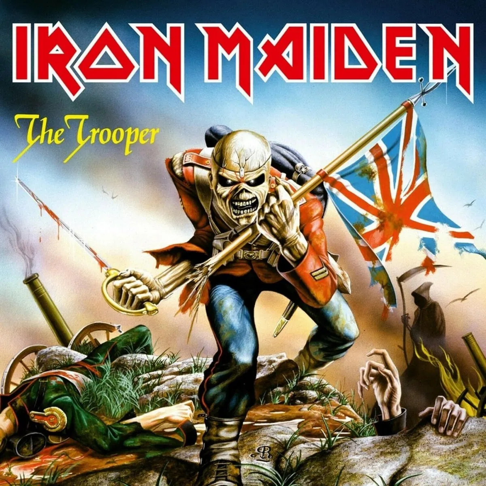

# Iron-maiden-songs

Neste repositório vamos treinar uma rede LSTM para "aprender" a compor frases de músicas do Iron Maiden.
Framework: Tensorflow

Para começar: 

** pip install -r requirements.txt

